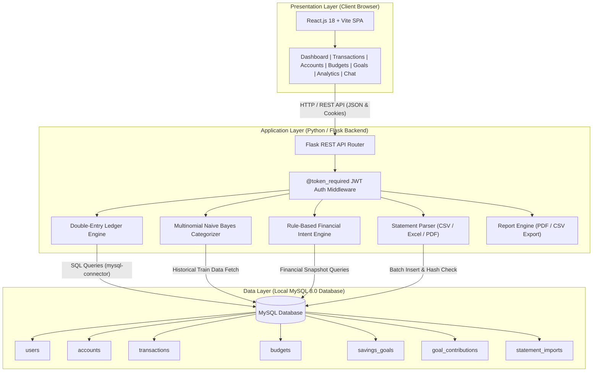
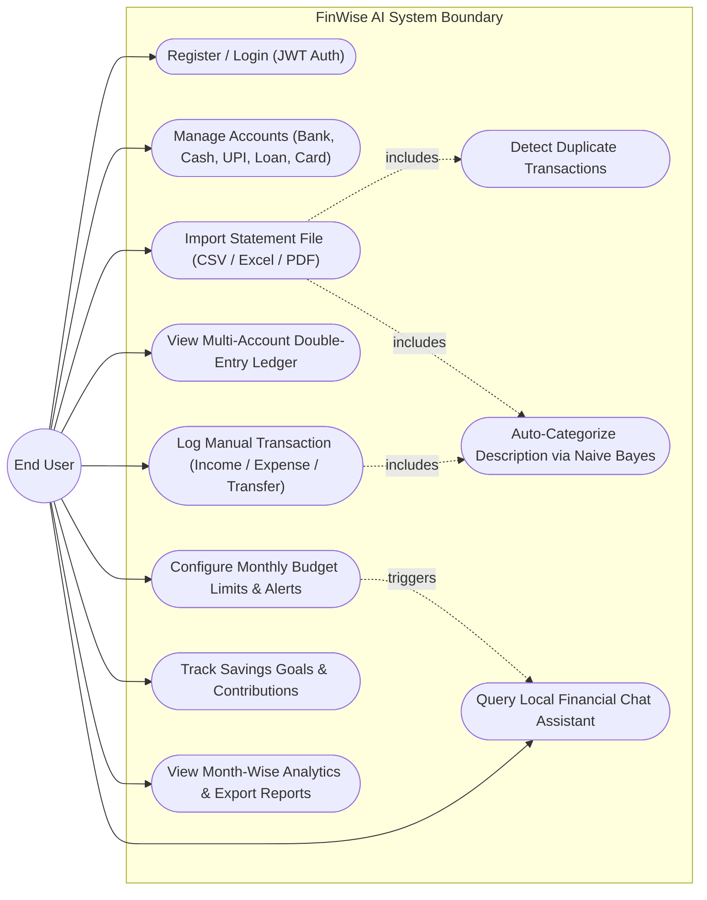
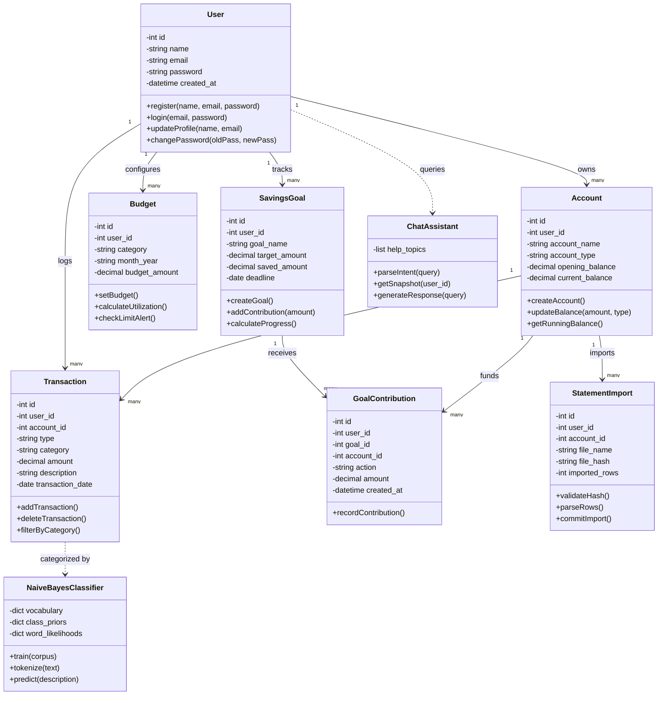
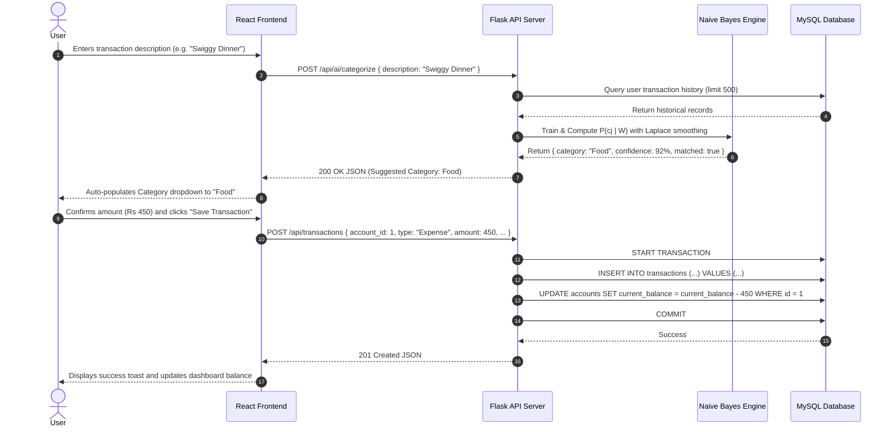
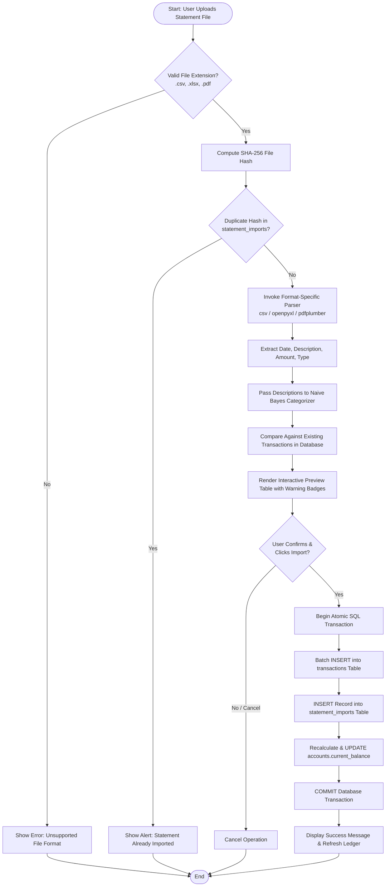
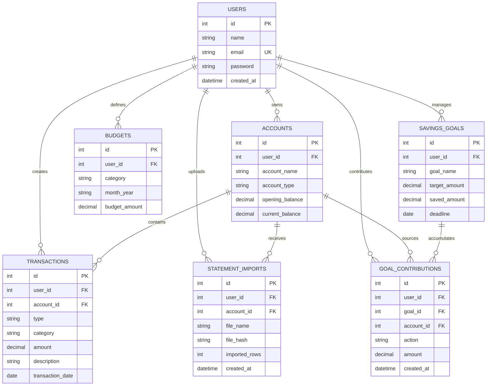
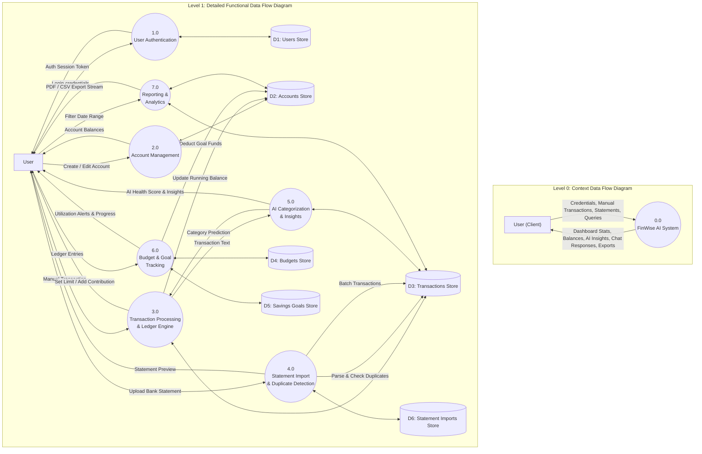

# PROJECT REPORT ON FINWISE AI
## SMART PERSONAL FINANCE MANAGEMENT SYSTEM

---

### ABSTRACT

**FinWise AI** is a comprehensive, offline-first personal finance management system designed to assist users in tracking their educational and professional financial transactions, managing budgets, and planning savings goals. Traditional finance apps depend on cloud databases and external servers, raising concerns about data privacy and internet reliability. FinWise AI resolves these issues by utilizing a local-first deployment model where user records, statements, and intelligent advice are processed entirely on the client’s machine.

Central to the system is a local intelligent categorizer based on a **Multinomial Naive Bayes** category prediction model that matches transaction descriptions to categories without sending transaction logs to third-party services. Additionally, an offline rule-based chat assistant answers finance-related queries, retrieves real-time database summaries, and offers actionable financial insights. 

Using modern web technologies—a **React** frontend, a **Flask (Python)** backend, and a **MySQL** database—FinWise AI separates responsibilities through a classic three-tier architecture. The system supports multi-account ledgers (Bank, Cash, UPI, Loans, Credit Cards, Investments), bank statement imports (CSV, Excel, text-based PDF) with automatic duplicate detection, and visual month-wise analytics. By consolidating accounting principles with local artificial intelligence, FinWise AI significantly reduces manual tracking workloads, secures private financial data, and enables users to establish sound budgets and savings habits.

---

### ACKNOWLEDGEMENT

I express my deepest gratitude to all who provided guidance and support during the design and development of FinWise AI. I thank our Institution Principal and Head of the Department for providing the resources and facilities needed to execute this project successfully.

I am deeply indebted to my project guide, [GUIDE_NAME], for their valuable guidance, structural recommendations, and critical reviews during the software engineering and testing lifecycles.

Finally, I thank my family members and peers for their continuous support and helpful feedback during the user acceptance testing iterations.

---

### TABLE OF CONTENTS

| S.NO | TITLE | PAGE NO. |
| :--- | :--- | :---: |
| | ABSTRACT | (i) |
| | ACKNOWLEDGEMENT | (ii) |
| | LIST OF TABLES | (iii) |
| | LIST OF FIGURES | (iv) |

| CHAPTERS | TITLE | PAGE NO. |
| :--- | :--- | :---: |
| **1** | **INTRODUCTION** | **01** |
| 1.1 | PROJECT INTRODUCTION | 01 |
| **2** | **WORKING ENVIRONMENT** | **02** |
| 2.1 | HARDWARE REQUIREMENT | 02 |
| 2.2 | SOFTWARE REQUIREMENT | 02 |
| 2.3 | SYSTEM SOFTWARE | 03 |
| **3** | **SYSTEM ANALYSIS** | **05** |
| 3.1 | FEASIBILITY STUDY | 05 |
| 3.2 | EXISTING SYSTEM | 05 |
| 3.3 | DRAWBACKS OF EXISTING SYSTEM | 06 |
| 3.4 | PROPOSED SYSTEM | 06 |
| 3.5 | BENEFITS OF PROPOSED SYSTEM | 07 |
| 3.6 | SCOPE OF THE PROJECT | 07 |
| **4** | **SYSTEM DESIGN** | **08** |
| 4.1 | SYSTEM ARCHITECTURE | 08 |
| 4.2 | SYSTEM DIAGRAMS | 09 |
| 4.3 | DATABASE DESIGN | 12 |
| **5** | **PROJECT DESCRIPTION** | **14** |
| 5.1 | OBJECTIVE | 14 |
| 5.2 | MODULE DESCRIPTION | 14 |
| 5.3 | IMPLEMENTATION | 16 |
| 5.4 | MAINTENANCE STRATEGY | 19 |
| **6** | **SYSTEM TESTING** | **20** |
| 6.1 | TESTING DEFINITION | 20 |
| 6.2 | TESTING OBJECTIVE | 20 |
| 6.3 | TYPES OF TESTING | 21 |
| 6.4 | TEST CASES | 21 |
| **7** | **CONCLUSION** | **23** |
| 7.1 | SUMMARY | 23 |
| 7.2 | FUTURE ENHANCEMENT | 23 |
| **8** | **APPENDIX** | **25** |
| 8.1 | SCREENSHOTS | 25 |
| 8.2 | CODING | 26 |
| 8.3 | DATA DICTIONARY | 32 |
| **9** | **BIBLIOGRAPHY AND REFERENCES** | **35** |

---

### LIST OF FIGURES

| FIGURE NO | TITLE | PAGE NO |
| :--- | :--- | :---: |
| 4.1 | SYSTEM ARCHITECTURE DIAGRAM | 08 |
| 4.2 | USE CASE DIAGRAM | 09 |
| 4.3 | CLASS DIAGRAM | 10 |
| 4.4 | SEQUENCE DIAGRAM | 11 |
| 4.5 | ERD DIAGRAM | 12 |
| 4.6 | DATA FLOW DIAGRAM | 13 |
| 8.1.1 | LOGIN PAGE | 25 |
| 8.1.2 | REGISTER PAGE | 25 |
| 8.1.3 | DASHBOARD | 25 |
| 8.1.4 | ACCOUNTS PAGE | 25 |
| 8.1.5 | TRANSACTIONS PAGE | 25 |
| 8.1.6 | ADD TRANSACTION PAGE | 25 |
| 8.1.7 | STATEMENT IMPORT PAGE | 25 |
| 8.1.8 | BUDGET PAGE | 25 |
| 8.1.9 | SAVINGS GOALS PAGE | 25 |
| 8.1.10 | ANALYTICS PAGE | 25 |
| 8.1.11 | FINANCIAL CHAT PAGE | 25 |

---

### LIST OF TABLES

| TABLE NO | TITLE | PAGE NO |
| :--- | :--- | :---: |
| 2.1 | HARDWARE REQUIREMENTS | 02 |
| 2.2 | SOFTWARE REQUIREMENTS | 02 |
| 3.1 | EXISTING SYSTEM VS PROPOSED SYSTEM | 06 |
| 5.2 | API DOCUMENTATION | 18 |
| 6.4 | TEST CASES | 21 |
| 8.1 | KEY CODING MODULES | 26 |
| 8.3 | DATA DICTIONARY | 32 |

---

## 1. INTRODUCTION

### 1.1 PROJECT INTRODUCTION

Managing personal finances is a foundational skill for students, working professionals, and families alike. In today's economy, individuals frequently move money across multiple channels, including traditional savings accounts, cash on hand, e-wallets, UPI accounts, and credit cards. When loans and investment balances are factored in, tracking financial health becomes challenging.

Many students and individuals record money details manually or keep them spread across bank apps, notes, and spreadsheets. This makes it difficult to know how much money is currently available, where money is being spent, whether a budget is being crossed, how much has been saved toward goals, and how loans and transfers affect account balances. Manual methods are error-prone, spreadsheets lack visual breakdowns, and cloud-based trackers violate privacy by storing logs on third-party servers.

The primary motivation is to empower users to take control of their finances without exposing their sensitive transaction data to third parties. By compiling data locally, FinWise AI guarantees maximum security and privacy. The integration of offline algorithms (Naive Bayes) shows that smart financial tracking does not depend on cloud-connected APIs.

FinWise AI is structured as an offline-first single-page application. The React user interface communicates with a local Flask server, which manages calculations and queries a MySQL database. Users can import transactions in CSV/Excel/PDF formats, manage double-entry ledger logs, configure categories, establish savings goals, and check budgets in a secure local dashboard.

---

## 2. WORKING ENVIRONMENT

### 2.1 HARDWARE REQUIREMENT

For the FinWise AI platform to run successfully, both the web browser client and the local database and application servers require standard computing hardware. Because all AI components run locally without connecting to external cloud servers, the local machine handles all prediction calculations.

##### TABLE 2.1 HARDWARE REQUIREMENTS

| COMPONENT | REQUIREMENT |
| :--- | :--- |
| Processor | Intel Core i5 / AMD Ryzen 5 or comparable (2.0 GHz or above) |
| RAM | 8 GB DDR4 or higher recommended |
| Hard Disk / SSD | Solid State Drive with 500 MB free space |
| Display | 1366 x 768 pixels or higher resolution |
| Keyboard | Standard QWERTY Keyboard |
| Mouse | Standard Optical Mouse |
| Network | Local Host Loopback Connection (Offline execution) |

### 2.2 SOFTWARE REQUIREMENT

The following software components are required to compile, host, and test FinWise AI:

##### TABLE 2.2 SOFTWARE REQUIREMENTS

| SOFTWARE | VERSION / REQUIREMENT |
| :--- | :--- |
| Operating System | Windows 10 / Windows 11 (64-bit) |
| Python | v3.10 or higher |
| Node.js | v18.0 or higher |
| React | v18.0 or higher |
| Flask | v3.0 or higher |
| MySQL | v8.0 or higher |
| Browser | Google Chrome, Microsoft Edge, Mozilla Firefox |
| Code Editor | Visual Studio Code / PyCharm |

### 2.3 SYSTEM SOFTWARE

The project integrates several system software tools and libraries to function:

1. **React.js**: Manages the Single Page Application UI. It dynamically updates page components using virtual DOM manipulation when transaction parameters change.
2. **Flask (Python)**: Coordinates REST API routes and business logic. It queries the local MySQL instance via mysql-connector, processes authentication cookies, runs Naive Bayes categorization, and compiles PDF reports.
3. **MySQL Database**: Coordinates data persistence. Enforces referential integrity (Cascades deletes) to keep transactions, accounts, and budget allocations in sync.

---

## 3. SYSTEM ANALYSIS

### 3.1 FEASIBILITY STUDY

#### Technical Feasibility
The system runs on React, Flask, and MySQL, which are widely-supported and lightweight tools. Since all AI/ML models run locally on the CPU, no expensive cloud services are required.

#### Operational Feasibility
The interface features a sidebar structure with forms and tables. Users can quickly enter details, preview imports, and chat in natural language, making the system easy to use.

#### Economic Feasibility
Built using free, open-source libraries, FinWise AI requires no ongoing server hosting costs, API charges, or cloud fees, making it highly cost-effective.

### 3.2 EXISTING SYSTEM

Currently, most individuals manage their money through manual bookkeeping, offline spreadsheets, or cloud-connected budgeting apps. In the existing setup, notebook entries require manually calculating running balances, spreadsheets lack visual alerts, and cloud apps automatically read bank details by linking accounts to third-party servers, raising privacy concerns.

### 3.3 DRAWBACKS OF EXISTING SYSTEM

1. **Lack of Centralization**: Cash, UPI, credit cards, and loan balances are tracked across separate apps, preventing a unified view.
2. **Data Security and Privacy Risks**: Online budget apps store transaction histories on cloud servers, exposing them to potential data leaks.
3. **No Automatic Categorization**: Spreadsheet users must manually assign categories to every transaction, increasing the manual tracking workload.
4. **Internet Dependency**: Cloud services are unusable without active network access, limiting accessibility.
5. **Complicated Account Balances**: Existing systems often struggle to track savings goals without counting them as standard expenses, which misrepresents available balances.
6. **No Real-Time Guidance**: Static ledger books and spreadsheets do not alert users when budgets are close to being exceeded or provide on-demand answers to financial questions.

### 3.4 PROPOSED SYSTEM

FinWise AI is a local personal finance tracker that runs on the user's computer. It features: a centralized ledger for multiple accounts, offline AI categorization using Naive Bayes, a local chat assistant, and bank statement import utilities with duplicate transaction detection.

##### TABLE 3.1 EXISTING SYSTEM VS PROPOSED SYSTEM

| ASPECT | EXISTING SYSTEM | PROPOSED SYSTEM |
| :--- | :--- | :--- |
| Data Management | Manual or scattered across multiple apps | Centralized, multi-account ledger database |
| Categorization | Manual category entry | Local Multinomial Naive Bayes prediction |
| Privacy & Security | Data stored on external cloud servers | Data stored locally in a private MySQL database |
| Analytics | Basic sheets or none | Dynamic month-wise charts |
| Budgeting | Manual check or none | Automatic utilization alerts (>80%) |
| Statement Import | Manual typing required | Batch imports (CSV/Excel/PDF) with duplicate checks |
| AI Assistance | None or cloud chatbots | Local, rule-based chatbot |

### 3.5 BENEFITS OF PROPOSED SYSTEM

* **100% Data Privacy**: Personal files and logs stay stored locally in the MySQL instance.
* **Zero Internet Dependency**: Once local dependencies are set up, the application runs entirely offline.
* **Local Machine Learning**: Predictions (Naive Bayes) do not connect to external servers.
* **Ledger Audit Trails**: Dynamic accounting updates keep multi-accounts reconciled.

### 3.6 SCOPE OF THE PROJECT

The current scope covers single-user offline finance tracking including multiple asset ledgers, CSV statement parsing, automatic duplicate check parameters, and monthly budget alerts. Future scopes include adding OCR, time-series forecasting, and direct local bank connectivity.

---

## 4. SYSTEM DESIGN

System design is the process of transforming software requirements into an architectural blueprint. It defines the components, data models, communication flows, and interfaces necessary to fulfill all functional and non-functional requirements. FinWise AI is built upon a classic **Three-Tier Architectural Model**, comprising the **Presentation Tier**, **Application Tier**, and **Data Tier**, ensuring high cohesion, loose coupling, complete offline operation, and rigorous data security.

### 4.1 SYSTEM ARCHITECTURE

The system architecture cleanly separates responsibilities across three independent layers:
1. **Presentation Layer (Client SPA)**: Built using React 18 and Vite. It runs inside the user's browser, providing reactive views for dashboards, multi-account ledgers, transaction records, statement import previews, budgets, savings goals, interactive analytics, and the local chat assistant.
2. **Application Layer (Python / Flask Backend)**: Hosts 42 REST API endpoints. It validates JWT session tokens, executes the double-entry ledger calculations, trains and runs the local Multinomial Naive Bayes text categorizer, matches conversational chat intents, and parses bank statement files.
3. **Data Layer (MySQL Local Database)**: Maintains persistent relational storage across 7 tables. It enforces referential integrity through foreign key cascades, isolates user data, and executes all balance updates inside atomic database transactions.

##### FIGURE 4.1 SYSTEM ARCHITECTURE DIAGRAM

### 4.2 SYSTEM DIAGRAMS

#### 4.2.1 USE CASE DIAGRAM

The Use Case Diagram illustrates the functional interactions between the primary actor (End User) and the system services across all core application capabilities.

##### FIGURE 4.2 USE CASE DIAGRAM

#### 4.2.2 CLASS DIAGRAM

The Class Diagram documents the object-oriented structure of the domain entities, attributes, visibility modifiers, methods, and relationship cardinalities governing the software.

##### FIGURE 4.3 CLASS DIAGRAM

#### 4.2.3 SEQUENCE DIAGRAM

The Sequence Diagram illustrates the step-by-step communication flow between the user interface, backend server, local machine learning classifier, and database during transaction creation.

##### FIGURE 4.4 SEQUENCE DIAGRAM

#### 4.2.4 ACTIVITY DIAGRAM

The Activity Diagram captures the decision points and execution sequence involved in parsing bank statements, verifying duplicate records, and updating the ledger balances.

##### FIGURE 4.5 ACTIVITY DIAGRAM

#### 4.2.5 ENTITY RELATIONSHIP DIAGRAM (ERD)

The Entity Relationship Diagram maps the relational schema, entity attributes, keys, and foreign key relationships that govern the MySQL database.

##### FIGURE 4.6 ENTITY RELATIONSHIP DIAGRAM

#### 4.2.6 DATA FLOW DIAGRAM (DFD)

The Data Flow Diagram models the movement of data between external users, processes, and local data stores across Level 0 (Context) and Level 1 (Detailed Functional) perspectives.

##### FIGURE 4.7 DATA FLOW DIAGRAM

### 4.3 DATABASE DESIGN

The physical MySQL implementation consists of the following 7 tables:

#### TABLE: USERS

| FIELD | TYPE | KEY | NULL | DESCRIPTION |
| :--- | :--- | :--- | :--- | :--- |
| id | INT | PK | NO | Unique ID of the user |
| name | VARCHAR(100) | - | NO | Full name of the user |
| email | VARCHAR(120) | UNIQUE | NO | Primary login email address |
| password | VARCHAR(255) | - | NO | Secure scrypt password hash |
| created_at | TIMESTAMP | - | NO | Account creation date |

#### TABLE: ACCOUNTS

| FIELD | TYPE | KEY | NULL | DESCRIPTION |
| :--- | :--- | :--- | :--- | :--- |
| id | INT | PK | NO | Unique account ID |
| user_id | INT | FK | NO | User ID mapping |
| account_name | VARCHAR(100) | - | NO | User assigned account name |
| account_type | ENUM | - | NO | Bank, Cash, UPI, Credit Card, Loan, Investment |
| opening_balance | DECIMAL(12,2) | - | YES | Starting account balance |
| current_balance | DECIMAL(12,2) | - | YES | Real-time running balance |

#### TABLE: TRANSACTIONS

| FIELD | TYPE | KEY | NULL | DESCRIPTION |
| :--- | :--- | :--- | :--- | :--- |
| id | INT | PK | NO | Unique transaction ID |
| user_id | INT | FK | NO | Owner user ID |
| account_id | INT | FK | NO | Primary account ID source |
| type | ENUM | - | NO | Income, Expense, Transfer |
| category | VARCHAR(100) | - | YES | Category classification |
| amount | DECIMAL(12,2) | - | NO | Numerical transaction amount |
| description | VARCHAR(255) | - | YES | Memo/note description |
| transaction_date | DATE | - | NO | Actual financial date |

#### TABLE: BUDGETS

| FIELD | TYPE | KEY | NULL | DESCRIPTION |
| :--- | :--- | :--- | :--- | :--- |
| id | INT | PK | NO | Unique budget ID |
| user_id | INT | FK | NO | User ID mapping |
| category | VARCHAR(100) | - | NO | Target expense category |
| month_year | VARCHAR(7) | - | NO | Format: YYYY-MM |
| budget_amount | DECIMAL(12,2) | - | NO | Monthly spending limit |

#### TABLE: SAVINGS_GOALS

| FIELD | TYPE | KEY | NULL | DESCRIPTION |
| :--- | :--- | :--- | :--- | :--- |
| id | INT | PK | NO | Unique goal ID |
| user_id | INT | FK | NO | User ID mapping |
| goal_name | VARCHAR(100) | - | NO | Goal name (e.g. laptop, trip) |
| target_amount | DECIMAL(12,2) | - | NO | Target money required |
| saved_amount | DECIMAL(12,2) | - | YES | Total amount saved |
| deadline | DATE | - | YES | Target target date |

#### TABLE: GOAL_CONTRIBUTIONS

| FIELD | TYPE | KEY | NULL | DESCRIPTION |
| :--- | :--- | :--- | :--- | :--- |
| id | INT | PK | NO | Unique contribution record |
| user_id | INT | FK | NO | User ID mapping |
| goal_id | INT | FK | NO | Savings goal target |
| account_id | INT | FK | NO | Deducted/added source account |
| action | ENUM | - | NO | Deposit, Withdraw |
| amount | DECIMAL(12,2) | - | NO | Transferred contribution amount |

#### TABLE: STATEMENT_IMPORTS

| FIELD | TYPE | KEY | NULL | DESCRIPTION |
| :--- | :--- | :--- | :--- | :--- |
| id | INT | PK | NO | Unique import task ID |
| user_id | INT | FK | NO | Import user mapping |
| account_id | INT | FK | NO | Target account mapping |
| file_name | VARCHAR(255) | - | NO | Imported statement file name |
| file_hash | CHAR(64) | - | NO | SHA-256 hash of statement (prevents re-imports) |
| imported_rows | INT | - | NO | Number of imported entries |

---

## 5. PROJECT DESCRIPTION

### 5.1 OBJECTIVE

The objective of FinWise AI is to deliver private, offline-first personal financial control. It establishes an accounting double-ledger that tracks transaction records across multiple accounts without connecting to cloud systems.

### 5.2 MODULE DESCRIPTION

#### 1. Authentication Module
* **Purpose**: Manages user registration, secure login, profile edits, and preferences.
* **Working**: Encrypts user passwords on signup using scrypt, validates on login, and registers browser session cookies.
* **Input**: User name, email, password, theme details.
* **Processing**: Scrypt hashing, JWT generation, secure cookie settings.
* **Output**: Session verification, personalized view profile.

#### 2. Account Management Module
* **Purpose**: Tracks current asset balances for multiple financial accounts.
* **Working**: Tracks bank balances, cash, UPI, credit card, loan, and investments, logging adjustments.
* **Input**: Account name, account type, opening balance.
* **Processing**: Real-time query calculations, updating current_balance records.
* **Output**: Aggregated current balances on screens.

#### 3. Transaction Management Module
* **Purpose**: Manages manual income, expense, and transfer records.
* **Working**: Records financial entries and automatically adjusts the corresponding account balances.
* **Input**: Type, category, amount, description, source/destination accounts.
* **Processing**: Applies debits and credits to corresponding database balances.
* **Output**: Refreshed dashboard aggregates and ledger records.

#### 4. Statement Import Module
* **Purpose**: Parses statements (CSV, Excel, PDF) into transaction lists.
* **Working**: Processes statements, checks files against hashes, and parses date, amount, and description fields.
* **Input**: CSV, Excel, or text-based PDF statement file.
* **Processing**: Parses files, checks hashes, and maps data columns.
* **Output**: Preview grid of transactions.

#### 5. AI Categorization Module
* **Purpose**: Categorizes transaction descriptions using a local Naive Bayes categorizer.
* **Working**: Tokenizes input strings and computes probabilities based on pre-defined keywords and user transaction history.
* **Input**: Transaction description string (e.g. 'Swiggy Dinner').
* **Processing**: Calculates probability scores for each category.
* **Output**: Suggested category with confidence level.

#### 6. Budget Management Module
* **Purpose**: Enables category budgeting limits and tracks monthly spending.
* **Working**: Defines category-wise boundaries and compares actual expenses to alert users when limits are exceeded.
* **Input**: Category, target month, limit amount.
* **Processing**: Aggregates monthly expense totals and compares them to limits.
* **Output**: Dashboard boundary warnings.

#### 7. Savings Goal Module
* **Purpose**: Manages savings goals and contributions.
* **Working**: Deducts contributions from a source account and updates goal saved totals.
* **Input**: Goal name, target amount, deadline, contribution amount.
* **Processing**: Creates contribution records and updates balances.
* **Output**: Goal progress tracking charts.

#### 8. Analytics Module
* **Purpose**: Provides visual charts showing financial trends.
* **Working**: Processes expense category totals and renders charts.
* **Input**: Date ranges, account filters.
* **Processing**: Queries database and compiles monthly cash flow aggregates.
* **Output**: Interactive graphs on the interface.

#### 9. Financial Chat Assistant
* **Purpose**: Conversational assistant answering help and database questions.
* **Working**: Tokenizes queries and matches them to help topics and database records locally.
* **Input**: User query prompt.
* **Processing**: Matches keywords and fetches account balances.
* **Output**: Chat answer with suggested help chips.

#### 10. Report Generation
* **Purpose**: Generates PDF and CSV exports of financial summaries.
* **Working**: Renders transaction tables and aggregates totals into files.
* **Input**: Start date, end date, filter category.
* **Processing**: Generates CSV and PDF streams.
* **Output**: Downloadable file.

### 5.3 IMPLEMENTATION

#### 5.3.1 Frontend Development (React, Vite, Bootstrap)
The Presentation Layer is developed as a Single Page Application (SPA) using React.js and Vite. Vite coordinates development servers and compiles files into static assets. Routing parameters are configured using React Router to navigate between Dashboard, Transactions, Accounts, Budgets, Savings Goals, and Analytics pages. State parameters are managed via local Hooks, such as useState for component variables and useEffect to fetch database summaries via REST API calls. Bootstrap CSS styles layout elements to render panels and forms that support responsive resizing. A custom theme state reads the user profile table to toggle light, dark, or system stylesheets dynamically. Browser authentication checks JWT tokens stored inside httpOnly cookie parameters, automatically redirecting logged-out users back to the login screen to protect internal dashboards.

#### 5.3.2 Backend Development (Flask API, Python)
The Application Layer is developed in Python using the Flask micro-framework. Flask handles incoming REST API calls, routing requests to corresponding controller functions. Security is coordinated via a custom @token_required decorator function that intercepts requests, extracts the JWT session cookie, validates the cryptographic signature using PyJWT, and fetches the user record. Database operations utilize a dedicated connection pool wrapping mysql.connector. When transaction edits or goals contributions occur, the Flask backend validates payloads, executes the necessary SQL commands inside database transactions, and returns standard JSON response payloads.

#### 5.3.3 Database Implementation (MySQL)
The Data Layer is persistent inside a local MySQL relational database schema. The schema comprises tables for users, accounts, transactions, budgets, savings goals, goal contributions, and statement imports. Referential integrity is enforced using foreign keys with CASCADE delete constraints. For example, deleting an account automatically clears all its transactions, keeping the ledger consistent. Queries are executed using parameterized statements to safeguard against SQL injection exploits. Critical database balance updates occur inside explicit transaction blocks, confirming updates are completed successfully before committing changes to disk.

#### 5.3.4 AI/ML Implementation (Multinomial Naive Bayes)
The local AI categorization module is developed natively in Python without relying on external cloud APIs, internet connectivity, or heavy third-party machine learning dependencies. It implements a Custom Multinomial Naive Bayes classification algorithm designed to execute with near-zero latency entirely on the host machine's CPU.

1. **Feature Extraction & Vocabulary Pipeline**:
On startup and dynamically during prediction queries, the engine establishes a dual-source training corpus. It combines a static domain taxonomy of 11 distinct financial categories (Food, Travel, Shopping, Medical, Entertainment, Bills, Groceries, Education, Insurance, Fuel, and Salary) with up to 500 historical transaction descriptions retrieved from the local MySQL database. Input transaction descriptions (e.g., `'Swiggy Dinner'` or `'Amazon Electronics'`) are normalized and tokenized into lowercase alphanumeric word arrays $W = \{w_1, w_2, \dots, w_k\}$.

2. **Bayes' Theorem & Logarithmic Formulation**:
The probability of category class $c_j$ given word tokens $W$ is formulated via Bayes' Theorem:
$$P(c_j \mid W) = \frac{P(c_j) \prod_{i=1}^{k} P(w_i \mid c_j)}{P(W)}$$

Because multiplying many fractional probabilities leads to floating-point numerical underflow, the calculation is computed in logarithmic space:
$$\log P(c_j \mid W) = \log P(c_j) + \sum_{i=1}^{k} \log P(w_i \mid c_j)$$

3. **Laplace (Add-1) Smoothing**:
To handle out-of-vocabulary terms and eliminate zero-probability multiplication errors, Laplace smoothing is applied to both class priors and word likelihoods:
$$P(c_j) = \frac{\text{Doc\_Count}(c_j) + 1}{\text{Total\_Docs} + |C|}$$
$$P(w_i \mid c_j) = \frac{\text{Word\_Count}(w_i, c_j) + 1}{\text{Total\_Words}(c_j) + |V|}$$

where $|C|$ is the total number of target categories (11), $|V|$ is the unique vocabulary size, and $\text{Total\_Words}(c_j)$ is the total count of words in category $c_j$.

4. **Confidence Estimation & Fallback Decision Boundary**:
To generate interpretable percentage confidence values without numerical overflow, log scores are normalized using an exponent-shift transformation:
$$\text{Normalized\_Prob}(c_j) = e^{\text{score}(c_j) - \text{max\_score}}$$
$$\text{Confidence}(c_{\text{best}}) = \frac{\text{Normalized\_Prob}(c_{\text{best}})}{\sum_{j=1}^{m} \text{Normalized\_Prob}(c_j)} \times 100\%$$

If the maximum confidence exceeds the 45% threshold and matches recognized vocabulary keywords, the predicted category is returned. Otherwise, the engine safely falls back to `'Other'` (`matched=False`), allowing the user to assign the category manually.

#### 5.3.5 Conversational Chat Engine
The Financial Chat Assistant operates locally as an interactive query utility. It implements keyword intent matching combined with database summaries. User queries are parsed into tokens and evaluated against keyword arrays. For instance, queries containing 'balance' match the account snapshot category, while queries with 'budget' trigger budget status. If a match is found, the system queries the database to build a dynamic report showing total cash balances, goal savings, or budgets exceeding 80% capacity. If no intent is matched, it queries help arrays or falls back to default guide prompts.

#### 5.3.6 Bank Statement Processing
Statement importing allows users to load transactions from bank statement files. The backend parses CSV statement fields using the Python csv package, Excel files using openpyxl, and text-based PDF files using pdfplumber to extract transaction dates, descriptions, and amounts. To prevent importing the same data twice, the backend computes a SHA-256 hash of the uploaded file and queries the statement_imports table. If a duplicate hash is found, it blocks the process. Additionally, it compares individual date, description, and amount values against existing entries to flag potential duplicate records in the preview grid before saving.

#### 5.3.7 Double-Entry Ledger Engine
The bookkeeping system is built on a double-entry ledger engine. Logging manual transactions adjusts balances. Income adds to the account balance, while Expense subtracts from it. For Transfers, the engine logs matching ledger entries representing a debit from the source account and a credit to the destination account within a single SQL transaction. The ledger fetches transactions chronologically and calculates a running balance: 

`Running Balance = Opening Balance + Credits - Debits`

This ensures the ledger remains balanced.

#### 5.3.8 API Documentation

##### TABLE 5.2 API DOCUMENTATION

| Method | Endpoint | Purpose | Auth Required | Payload Request | Response Type |
| :--- | :--- | :--- | :--- | :--- | :--- |
| GET | / | Serves frontend index.html page. | No | None | HTML Page Stream |
| POST | /api/register | Register a new user. | No | name, email, password | success / error message |
| POST | /api/login | Logs in user and sets secure JWT httpOnly cookies. | No | email, password | user info or error |
| POST | /api/refresh | Refresh user session JWT token. | No | cookie token | token refresh confirm |
| POST | /api/logout | Clears cookies and invalidates session. | Yes | None | logout confirm message |
| POST | /api/password/forgot | Initiate password reset (generates local token). | No | email | reset instructions |
| POST | /api/email/verify | Verify email address via token. | No | token | verification status |
| POST | /api/password/reset | Reset password with token. | No | token, password | success / error status |
| GET | /api/profile | Fetch logged-in user profile details. | Yes | cookie token | user profile JSON |
| PUT | /api/profile | Update user profile details. | Yes | name, email | updated profile details |
| PUT | /api/profile/password | Update user login password. | Yes | old_password, new_password | success / error status |
| GET | /api/dashboard | Fetch combined financial stats and overview. | Yes | cookie token | aggregated balances and alerts |
| GET | /api/accounts | Fetch all user account objects. | Yes | cookie token | list of accounts |
| POST | /api/accounts | Add a new financial account. | Yes | name, type, opening_balance | created account object |
| PUT | /api/accounts/<int:account_id> | Edit account parameters. | Yes | name, credit_limit, last4 | updated account object |
| DELETE | /api/accounts/<int:account_id> | Remove account and related transactions. | Yes | account_id | success confirmation |
| GET | /api/transactions | Fetch transaction list with filters. | Yes | page, account_id, search | paginated transaction array |
| GET | /api/ledger | Fetch double-entry ledger rows. | Yes | account_id | ledger statements with balances |
| POST | /api/transactions | Create manual transaction. | Yes | type, amount, account_id, date | created transaction object |
| DELETE | /api/transactions/<int:tid> | Remove transaction entry. | Yes | tid | success confirmation |
| GET | /api/budgets | Fetch monthly budget limits & spent statistics. | Yes | cookie token | budget utilization list |
| POST | /api/budgets | Create new budget limit. | Yes | category, month_year, budget_amount | budget confirm |
| PUT | /api/budgets/<int:budget_id> | Edit budget limit. | Yes | category, budget_amount | updated budget |
| DELETE | /api/budgets/<int:budget_id> | Delete budget limit. | Yes | budget_id | delete confirm |
| GET | /api/goals | Fetch savings goals list. | Yes | cookie token | savings goals array |
| POST | /api/goals | Create a new savings goal. | Yes | goal_name, target_amount, deadline | created goal object |
| PUT | /api/goals/<int:goal_id> | Update goal details. | Yes | goal_name, target_amount, deadline | updated goal object |
| DELETE | /api/goals/<int:goal_id> | Delete savings goal. | Yes | goal_id | delete confirm |
| POST | /api/goals/<int:goal_id>/contributions | Add savings goal deposit/withdrawal. | Yes | account_id, action, amount | updated goal object |
| GET | /api/goals/<int:goal_id>/contributions | Fetch contribution history for goal. | Yes | goal_id | contributions array |
| GET | /api/savings/activity | Fetch total goal activities log. | Yes | cookie token | list of all contributions |
| GET | /api/analytics/category | Group expenses by category. | Yes | cookie token | categories with total sums |
| GET | /api/analytics/monthly | Fetch monthly income/expense trends. | Yes | cookie token | month lists with cash flow stats |
| GET | /api/reports/csv | Export all transactions in CSV format. | Yes | start_date, end_date | CSV file download |
| POST | /api/ai/categorize | Predict category from text description. | Yes | description | predicted category, confidence |
| GET | /api/ai/insights | Fetch automated data insights. | Yes | cookie token | health score and text list |
| POST | /api/ai/chat | Submit prompt to offline chat advisor. | Yes | message | bot answer text & chips |
| POST | /api/statements/preview | Upload statement and check duplicates. | Yes | file (multipart) | parsed rows preview array |
| POST | /api/statements/import | Save previewed statement rows to database. | Yes | account_id, transactions | success count message |
| GET | /api/smart/subscriptions | Fetch recurring payment candidates. | Yes | cookie token | lists of recurring items |
| POST | /api/automation/recurring | Create recurring transaction schedule. | Yes | account_id, type, amount | created template object |
| GET | /api/automation/recurring/runs | Check and execute due recurring items. | Yes | cookie token | list of executed entries |

### 5.4 MAINTENANCE STRATEGY

1. **Corrective Maintenance**: Resolving runtime issues, such as resolving statement parsing discrepancies or balance calculation errors.
2. **Adaptive Maintenance**: Updating frontend and backend dependencies to keep the application compatible with updated browsers and library versions.
3. **Perfective Maintenance**: Indexing frequently queried database columns (e.g. account_id and user_id) to improve transaction page load speeds.

---

## 6. SYSTEM TESTING

### 6.1 TESTING DEFINITION

System testing evaluates the integrated FinWise AI application to verify it meets design requirements. The testing process checks frontend components, backend API logic, and the local database connection as a unified system.

### 6.2 TESTING OBJECTIVE

1. Confirm calculations are accurate across accounts, budgets, and savings goals.
2. Verify the accuracy of the local Naive Bayes categorizer.
3. Ensure user sessions are secure and API requests require token verification.
4. Verify the CSV, Excel, and PDF statement processors parse files without errors.
5. Ensure duplicate transactions are detected and handled correctly during imports.

### 6.3 TYPES OF TESTING

Unit, Integration, and end-to-end System testing are performed offline.

### 6.4 TEST CASES

##### TABLE 6.4 TEST CASES

| TEST CASE ID | TEST CASE | INPUT | EXPECTED OUTPUT | ACTUAL OUTPUT | STATUS |
| :--- | :--- | :--- | :--- | :--- | :---: |
| TC001 | User Registration | Submit sign-up form with unique email. | User account created and saved in user table. | User account created and saved in user table. | PASS |
| TC002 | User Login | Enter valid registered credentials. | Access token generated, login success. | Access token generated, login success. | PASS |
| TC003 | Invalid Login | Enter incorrect password or email. | Error message displayed. | Error message displayed. | PASS |
| TC004 | Create Account | Add Bank Account, opening balance Rs 10000. | Account created in DB, current_balance is 10000. | Account created in DB, current_balance is 10000. | PASS |
| TC005 | Add Expense Entry | Record manual Expense of Rs 1500. | Deducts Rs 1500 from bank balance. | Deducts Rs 1500 from bank balance. | PASS |
| TC006 | Add Income Entry | Record manual Income of Rs 25000. | Adds Rs 25000 to bank balance. | Adds Rs 25000 to bank balance. | PASS |
| TC007 | Add Transfer Entry | Record Transfer of Rs 3000 from Bank to UPI. | Bank decremented by 3000, UPI incremented by 3000. | Bank decremented by 3000, UPI incremented by 3000. | PASS |
| TC008 | Ledger calculation | View Ledger of Cash account. | Displays running balance: opening + credits - debits. | Displays running balance: opening + credits - debits. | PASS |
| TC009 | Upload CSV statement | Upload valid bank statement CSV file. | Parses file, displays grid preview of rows. | Parses file, displays grid preview of rows. | PASS |
| TC010 | Duplicate check | Upload same statement CSV twice. | Flags rows already present as duplicate. | Flags rows already present as duplicate. | PASS |
| TC011 | Naive Bayes Categorizer | Provide text 'Swiggy Dinner'. | Returns Food category with confidence. | Returns Food category with confidence. | PASS |
| TC012 | Set category budget | Define Rs 10000 limit for Food. | Budget added to table for current month-year. | Budget added to table for current month-year. | PASS |
| TC013 | Budget limit warning | Log food expense pushing total to Rs 8500. | Dashboard displays warning alert (usage >80%). | Dashboard displays warning alert (usage >80%). | PASS |
| TC014 | Create goal contribution | Contribute Rs 5000 from Bank to Laptop Goal. | Laptop saved amount increases, Bank decremented. | Laptop saved amount increases, Bank decremented. | PASS |
| TC015 | Chat help request | Submit question: 'how to add transfer?'. | Returns help answer for transfer transactions. | Returns help answer for transfer transactions. | PASS |
| TC016 | Chat data query | Submit question: 'what is my balance?'. | Queries database, returns balance summary. | Queries database, returns balance summary. | PASS |
| TC017 | Export reports | Request CSV transaction report download. | Generates CSV byte stream download. | Generates CSV byte stream download. | PASS |
| TC018 | Session Timeout / Logout | Click logout button. | Access token cookie cleared, session terminated. | Access token cookie cleared, session terminated. | PASS |

---

## 7. CONCLUSION

### 7.1 SUMMARY

FinWise AI is a complete, offline-first personal finance management system. The application coordinates financial tracking across multiple accounts, including bank accounts, cash, UPI wallets, credit cards, investments, and loans. By utilizing local data management and custom classification algorithms, the system provides personal finance tools while keeping user data secure.

### 7.2 FUTURE ENHANCEMENT

1. **Advanced ML Forecasting**: Integrate regression models to forecast future utility expenses based on seasonal usage trends.
2. **Optical Character Recognition (OCR)**: Integrate an offline OCR library to extract transaction details directly from images of receipts.
3. **Automatic Statement Synchronization**: Build secure integrations with open banking APIs to allow optional statement updates when internet access is available.
4. **Advanced Calculators**: Add interactive planning tools for loan EMI schedules and credit card interest calculations.
5. **Mobile Application**: Build a React Native client that shares the local database schema, enabling mobile tracking.

---

## 8. APPENDIX

### 8.1 SCREENSHOTS

##### FIGURE 8.1.1 LOGIN PAGE
Input email and password, with options to register or trigger password resets.

##### FIGURE 8.1.2 REGISTER PAGE
Create new account using name, email, and password.

##### FIGURE 8.1.3 DASHBOARD
Financial summaries (Total, Balance, Savings), recent transactions list, and budget boundary alerts.

##### FIGURE 8.1.4 ACCOUNTS PAGE
Add and view configured financial accounts.

##### FIGURE 8.1.5 TRANSACTIONS PAGE
Ledger table displaying date, type, category, amount, and descriptions.

##### FIGURE 8.1.6 ADD TRANSACTION PAGE
Input manual income, expense, or transfer details.

##### FIGURE 8.1.7 STATEMENT IMPORT PAGE
Choose a statement file and preview parsed transactions.

##### FIGURE 8.1.8 BUDGET PAGE
Set monthly category limits and monitor utilization progress bars.

##### FIGURE 8.1.9 SAVINGS GOALS PAGE
View progress bars showing saved amounts against goal targets.

##### FIGURE 8.1.10 ANALYTICS PAGE
Dynamic visual charts tracking category-wise expense breakdowns.

##### FIGURE 8.1.11 FINANCIAL CHAT PAGE
Conversational chat interface to query database facts locally.

### 8.2 CODING

##### TABLE 8.1 KEY CODING MODULES

| FILE PATH | PURPOSE | KEY METHODS |
| :--- | :--- | :--- |
| frontend/src/main.jsx | Configures routing and auth session redirection. | App() wrapper |
| frontend/src/pages/Dashboard.jsx | Aggregates sidebar layout and coordinates active views. | Dashboard(), navigate(), render() |
| backend/db.py | Database connection pool wrapper. | get_conn(), query() |
| backend/auth.py | Coordinates encryption hashes and JWT session middleware. | hash_password(), verify_password(), token_required() |
| backend/app.py | Coordinates API endpoints and runs Naive Bayes categorizer. | naive_bayes_category(), ai_insights(), categorize(), chat() |

### 8.3 DATA DICTIONARY

##### TABLE 8.3 DATA DICTIONARY

| TABLE NAME | FIELD NAME | DATA TYPE | KEY | NULL | DESCRIPTION |
| :--- | :--- | :--- | :--- | :--- | :--- |
| USERS | id | INT | PK | NO | Unique ID of the user |
| USERS | name | VARCHAR(100) | - | NO | Full name of the user |
| USERS | email | VARCHAR(120) | UNIQUE | NO | Primary login email address |
| USERS | password | VARCHAR(255) | - | NO | Secure scrypt password hash |
| USERS | created_at | TIMESTAMP | - | NO | Account creation date |
| ACCOUNTS | id | INT | PK | NO | Unique account ID |
| ACCOUNTS | user_id | INT | FK | NO | User ID mapping |
| ACCOUNTS | account_name | VARCHAR(100) | - | NO | User assigned account name |
| ACCOUNTS | account_type | ENUM | - | NO | Bank, Cash, UPI, Credit Card, Loan, Investment |
| ACCOUNTS | opening_balance | DECIMAL(12,2) | - | YES | Starting account balance |
| ACCOUNTS | current_balance | DECIMAL(12,2) | - | YES | Real-time running balance |
| TRANSACTIONS | id | INT | PK | NO | Unique transaction ID |
| TRANSACTIONS | user_id | INT | FK | NO | Owner user ID |
| TRANSACTIONS | account_id | INT | FK | NO | Primary account ID source |
| TRANSACTIONS | type | ENUM | - | NO | Income, Expense, Transfer |
| TRANSACTIONS | category | VARCHAR(100) | - | YES | Category classification |
| TRANSACTIONS | amount | DECIMAL(12,2) | - | NO | Numerical transaction amount |
| TRANSACTIONS | description | VARCHAR(255) | - | YES | Memo/note description |
| TRANSACTIONS | transaction_date | DATE | - | NO | Actual financial date |
| BUDGETS | id | INT | PK | NO | Unique budget ID |
| BUDGETS | user_id | INT | FK | NO | User ID mapping |
| BUDGETS | category | VARCHAR(100) | - | NO | Target expense category |
| BUDGETS | month_year | VARCHAR(7) | - | NO | Format: YYYY-MM |
| BUDGETS | budget_amount | DECIMAL(12,2) | - | NO | Monthly spending limit |
| SAVINGS_GOALS | id | INT | PK | NO | Unique goal ID |
| SAVINGS_GOALS | user_id | INT | FK | NO | User ID mapping |
| SAVINGS_GOALS | goal_name | VARCHAR(100) | - | NO | Goal name (e.g. laptop, trip) |
| SAVINGS_GOALS | target_amount | DECIMAL(12,2) | - | NO | Target money required |
| SAVINGS_GOALS | saved_amount | DECIMAL(12,2) | - | YES | Total amount saved |
| SAVINGS_GOALS | deadline | DATE | - | YES | Target target date |
| GOAL_CONTRIBUTIONS | id | INT | PK | NO | Unique contribution record |
| GOAL_CONTRIBUTIONS | user_id | INT | FK | NO | User ID mapping |
| GOAL_CONTRIBUTIONS | goal_id | INT | FK | NO | Savings goal target |
| GOAL_CONTRIBUTIONS | account_id | INT | FK | NO | Deducted/added source account |
| GOAL_CONTRIBUTIONS | action | ENUM | - | NO | Deposit, Withdraw |
| GOAL_CONTRIBUTIONS | amount | DECIMAL(12,2) | - | NO | Transferred contribution amount |
| STATEMENT_IMPORTS | id | INT | PK | NO | Unique import task ID |
| STATEMENT_IMPORTS | user_id | INT | FK | NO | Import user mapping |
| STATEMENT_IMPORTS | account_id | INT | FK | NO | Target account mapping |
| STATEMENT_IMPORTS | file_name | VARCHAR(255) | - | NO | Imported statement file name |
| STATEMENT_IMPORTS | file_hash | CHAR(64) | - | NO | SHA-256 hash of statement (prevents re-imports) |
| STATEMENT_IMPORTS | imported_rows | INT | - | NO | Number of imported entries |

---

## 9. BIBLIOGRAPHY AND REFERENCES

1. Roger S. Pressman, Software Engineering: A Practitioner’s Approach, McGraw-Hill Education.
2. Ian Sommerville, Software Engineering, Pearson Education.
3. Christopher D. Manning, Prabhakar Raghavan, & Hinrich Schütze, Introduction to Information Retrieval (Chapter 13: Naive Bayes text classification), Cambridge University Press.
4. React Official Documentation - https://react.dev (Frontend framework reference).
5. Flask micro-framework Documentation - https://flask.palletsprojects.com (REST API routing reference).
6. MySQL Database Documentation - https://dev.mysql.com/doc (Database design reference).
